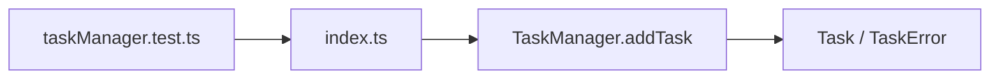
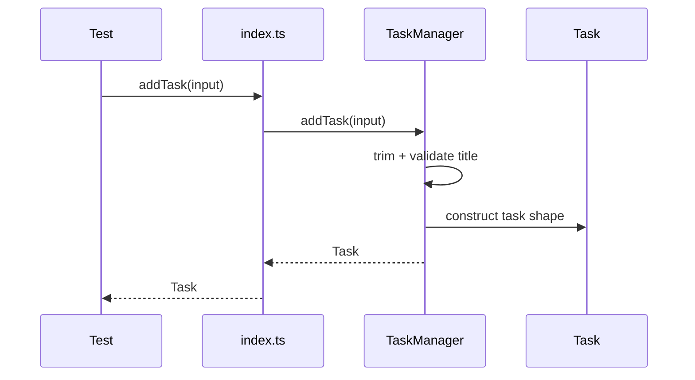
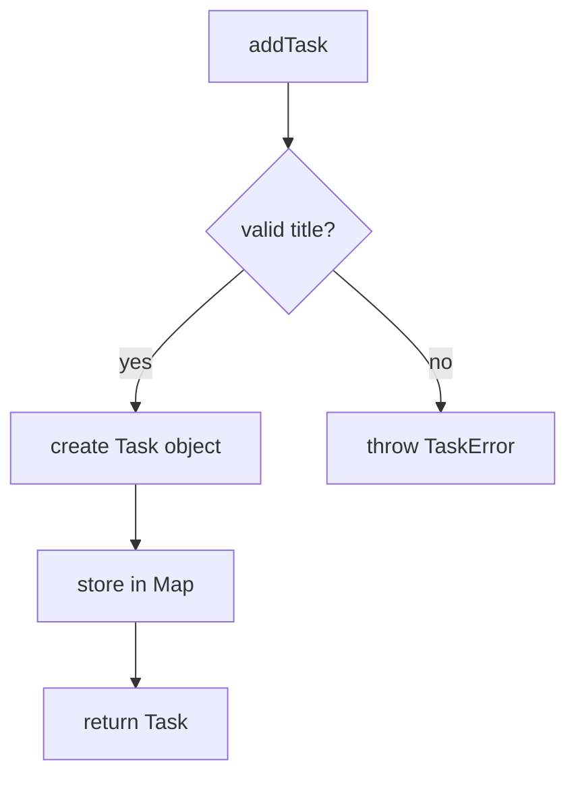
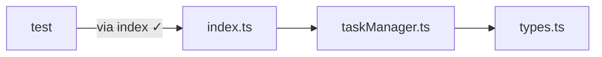

# Skill: code-review-slice-diagrams

Purpose: generate a small set of review-oriented Mermaid diagrams for a targeted slice of a codebase, so reviewers can inspect the exact behavior or boundary that matters without drowning in the whole graph.

When to use:
- A PR or review is focused on one behavior, feature, bugfix, or refactor.
- A full dependency graph is too broad.
- You want diagrams optimized for code review comments, not architecture documentation.

Core idea:
Review by slice, not by universe. Each diagram should answer a concrete review question.

Typical slice questions:
- How does `addTask` flow from test or entry point to model changes?
- Which modules/classes participate in validation?
- Where does persistence or I/O happen?
- Which public API methods reach into feature internals?
- What changed structurally in this PR?

Diagram pack this skill should produce:
1. Entry-point slice
2. Main success-path slice
3. Failure-path or validation slice
4. Boundary-risk slice

Entry-point slice — show the few nodes connecting the test/public API to the implementation core.

Success-path — show the main ordered interactions. Sequence diagrams are often best when responsibility and order matter.

Failure-path — show validation, error throwing, branching, and cleanup.

Boundary-risk — show suspicious cross-layer or cross-feature calls.

Output format for each slice:
1. Title
2. Review question it answers
3. Why this slice matters
4. Mermaid block
5. 3-6 review bullets

Example pack:

### 1. Entry-point slice

### 2. Success-path slice

### 3. Failure-path slice

### 4. Boundary-risk slice

How to choose slices:
- Use changed files, touched functions, failing tests, or user-reported bug path
- Prefer slices with the highest review payoff
- Limit to 3-5 slices per review round
- Keep diagrams readable in a PR diff or markdown preview

Guardrails:
- Do not redraw the whole system.
- Do not include every helper.
- Do not skip failure paths for critical code.
- Distinguish between observed and inferred interactions.
- When uncertain, present two narrow slice options rather than one oversized diagram.
