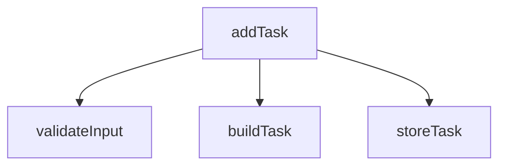
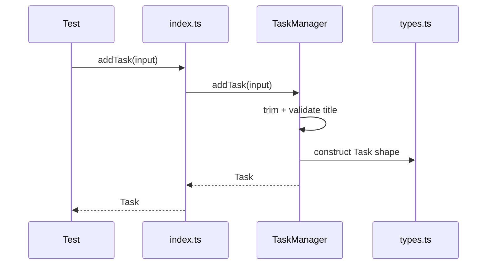
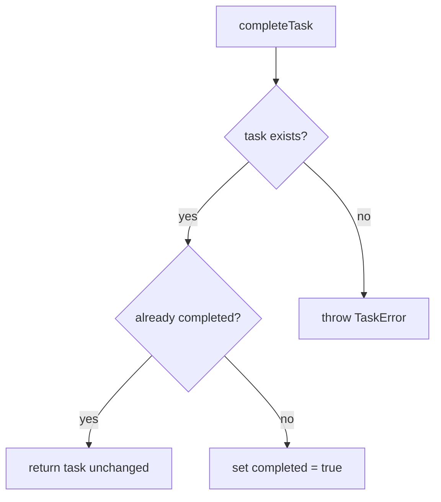

# Skill: internal-callflow-diagram

Purpose: generate Mermaid diagrams for function and method relationships inside a module, class, or feature, with emphasis on review-relevant call paths rather than exhaustive graphs.

When to use:
- The code is function-heavy or mixed OO/functional.
- The reviewer wants to know "what calls what".
- A feature path such as add/update/delete/validate/auth needs to be understood.
- The codebase is large enough that raw static call graphs are noisy and need curation.

Core principle:
Static call graphs are useful but imperfect. Use them to discover likely relationships, then curate diagrams around review questions. Never imply that a static edge guarantees runtime behavior.

Preferred diagram types:
- `flowchart TD` or `graph LR` for static call relationships
- `sequenceDiagram` for a specific behavior path or request lifecycle
- Avoid `classDiagram` here unless the focus becomes structural rather than behavioral

What to extract:
- Exported functions
- Important internal helper functions
- Class methods that participate in the target path
- Calls to validators, mappers, repositories, API clients, serializers, parsers
- Error and branching paths where they matter
- Async boundaries and retries when relevant

Diagram styles:

1. Static call graph — use when showing likely code relationships, not time order.

2. Sequence diagram — use when showing ordered interaction across objects/modules.

3. Branch-focused flow — use when a method has critical conditionals.

Curation rules:
- Center each diagram on one question.
- Limit to roughly 8-20 nodes unless the user explicitly wants a broader view.
- Prefer 2-4 diagrams over one crowded graph.
- Include error paths for critical operations.
- Mark uncertain edges as inferred if needed.

Review annotations to include:
- Entry point
- Main collaborators
- Hidden branching points
- Error paths worth reviewing
- Whether the flow is easy or hard to test
- Whether orchestration appears too centralized

Large-code heuristics:
- Start from a named function or public method, not the whole repo
- For a large feature, provide:
  - one entry-point graph
  - one success-path sequence diagram
  - one failure-path or branch diagram
- Collapse trivial helpers unless they are the review concern
- Separate pure calculations from side-effecting calls

Questions to ask when needed:
- Which function or method should be the entry point?
- Do you want static call relationships or ordered behavior?
- Should internal helpers be included?
- Should tests be shown as participants?

Guardrails:
- Do not claim completeness for dynamic dispatch, callbacks, reflection, or metaprogramming.
- Do not label a static graph as runtime truth.
- For very large modules, slice by use case instead of drawing everything.
- When the repo is TS-heavy, prefer AST-backed extraction if available.
