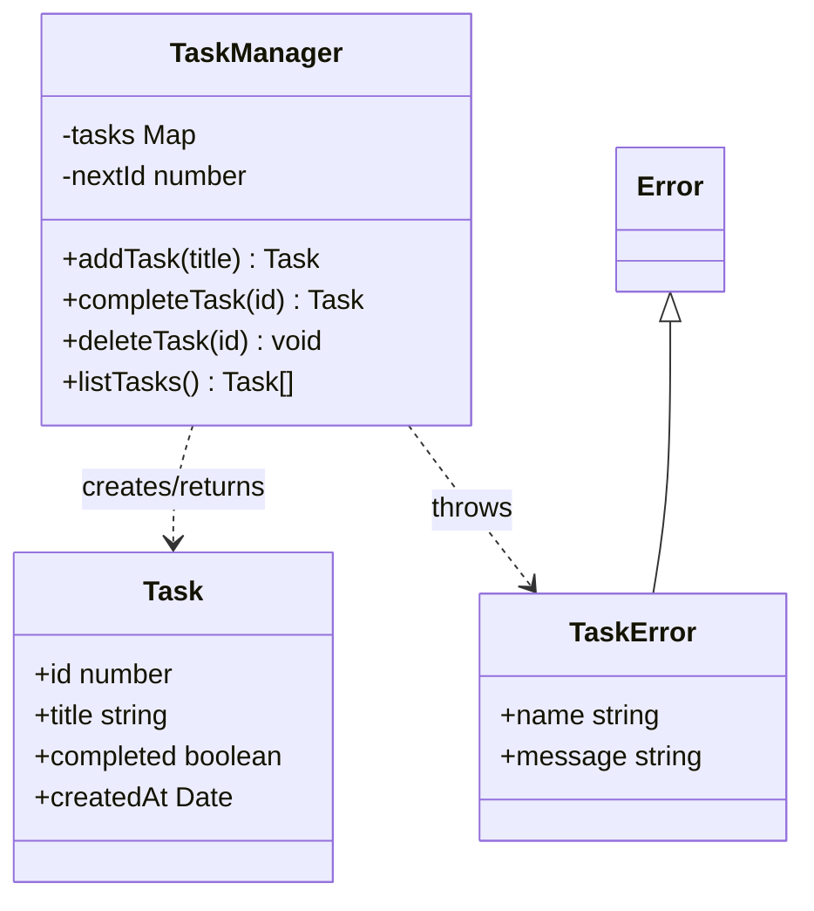

# Skill: internal-class-diagram

Purpose: generate Mermaid class diagrams for a target module, folder, or feature so code review can see class, interface, and exported API structure at a glance.

When to use:
- A target module contains classes, interfaces, services, repositories, controllers, managers, or adapters.
- The reviewer wants structural understanding inside a package or feature.
- The codebase is medium or large enough that file-level dependency graphs are not enough.
- You want a stable diagram for docs, PR discussion, onboarding, or architecture review.

Main output:
- A curated Mermaid `classDiagram`
- Optional companion bullets explaining the review significance of the relationships

What this skill should extract:
- Classes
- Interfaces
- Type aliases when they materially shape a public API
- Public methods and selected private methods only when they matter to review
- Key fields only when they represent dependencies, ownership, or state
- Inheritance and implementation
- Composition / aggregation / dependency / association style relationships
- Exported API surface for the target slice

What this skill should NOT do:
- Do not dump every method from a large class.
- Do not model every private helper.
- Do not produce a repo-wide UML hairball.
- Do not pretend runtime order; this is structural, not behavioral.

Inputs:
- One file, class, folder, or feature
- Optional focus question, e.g.:
  - "show service/repository relationships"
  - "show domain model and errors"
  - "show public API only"
  - "show only classes touched by add/remove/update flow"

Default scope rules:
- If one file: include main classes/interfaces and closely related types in that file.
- If one folder: include only top-level exported classes/interfaces plus their most important relationships.
- If a feature is large: split into 2-4 diagrams, e.g. API surface, domain model, infra bindings.

Relationship mapping guidance:
- Inheritance: `<|--`
- Implementation: `<|..`
- Composition: `*--`
- Aggregation: `o--`
- Association: `-->`
- Dependency: `..>`

Use these conservatively. If the exact relationship is unclear, prefer dependency over stronger ownership claims.

Mermaid syntax guidance:
- Use `classDiagram`
- Show methods with `()`
- Use visibility markers only if they help review:
  - `+` public
  - `-` private
  - `#` protected
  - `~` internal/package
- Keep names short but recognizable
- Avoid exotic Mermaid features that break across renderers

Example output:

Review annotations to include:
- What the central class or interface is
- Which dependencies are structural hotspots
- Whether one class appears too broad
- Whether public API shape is clean or leaky
- Whether the model seems stable or over-coupled

Heuristics for large code:
- Prefer one "central structure" diagram over a full dump
- Cap at roughly 6-12 classes/interfaces per diagram when possible
- Show only methods relevant to the review question
- Split by layer if the folder mixes UI, domain, and infra

Questions to ask when needed:
- Which module or folder should be visualized?
- Do you want public API only or internals too?
- Should this optimize for review, onboarding, or design discussion?
- Which behavior or class is currently under review?

Guardrails:
- State clearly when a relationship is inferred rather than explicit.
- If the code is mostly functional, recommend `internal-callflow-diagram` instead.
- If the diagram becomes crowded, split it rather than shrinking readability.
