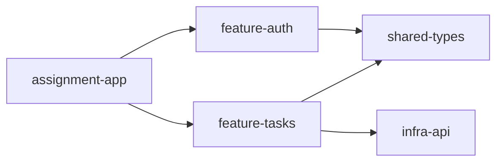
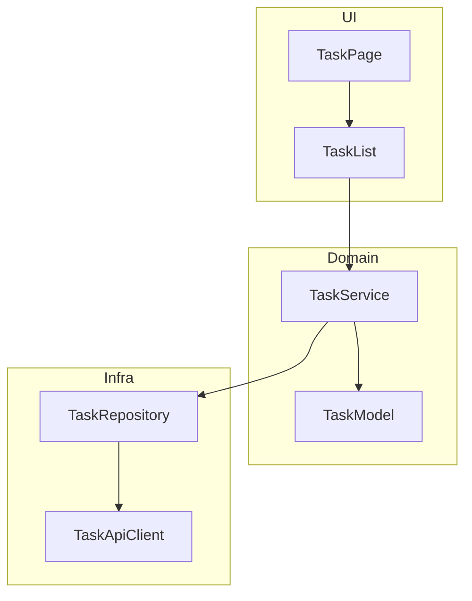
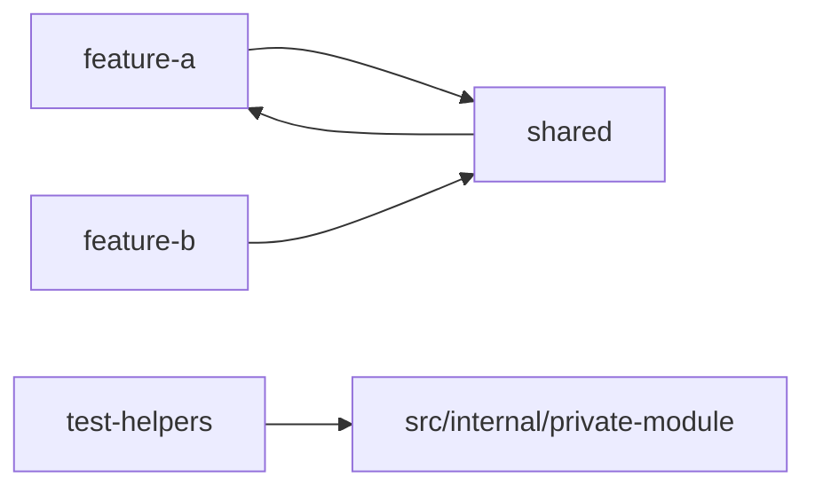
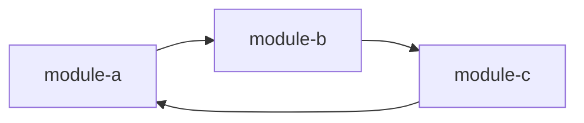

# Skill: code-graph-mermaid

Purpose: convert raw dependency information into small, readable Mermaid diagrams that improve code review instead of overwhelming it.

When to use:
- After code-graph-scout has produced graph facts.
- When the reviewer needs diagrams in Markdown for Claude, GitHub, or docs.
- When raw Nx or dependency-cruiser output is too large to be useful directly.

Principle:
A useful Mermaid diagram is curated. Do not try to mirror the entire repo unless it is tiny. Prefer 5-20 nodes per diagram.

Inputs:
- Nx graph JSON or focused Nx graph findings.
- dependency-cruiser JSON or Mermaid plugin output.
- A chosen review scope: repo, project, feature, slice, or risky path.

Diagram types to produce:
1. Workspace dependency map
2. Feature dependency map
3. Layered architecture map
4. Suspicious dependency map
5. Request or execution flow map
6. Cycle-focused map

Preferred Mermaid forms:
- `graph LR` for dependency direction
- `flowchart TD` for layered or request flow
- `sequenceDiagram` for runtime interaction only when the path is known from code
- `classDiagram` rarely, only when class structure is central to review

Rules for good diagrams:
- Keep each diagram narrow in purpose.
- Use one diagram per question.
- Group nodes by layer or feature.
- Collapse low-value leaves.
- Highlight suspicious edges with labels rather than color assumptions.
- Add 2-5 bullets under each diagram explaining why it matters in review.

Default diagram set:
1. Repo-level map, only major projects/packages.
2. One focused diagram for the target assignment/project.
3. One risk diagram showing cycles, shared hubs, or forbidden-looking imports.

Mermaid generation guidance:
- Prefer stable node IDs and human-readable labels.
- Use subgraphs for layers: app, feature, domain, shared, infra, tests.
- Show dependency direction consistently as “imports/depends on”.
- Avoid crossing lines when possible by choosing LR vs TD intentionally.
- Do not emit 100-node hairballs.

Example templates:

Workspace map:

Layered map:

Suspicious dependency map:

Cycle map:

Transformation rules:
- From Nx: use projects as nodes; add only relevant dependencies.
- From dependency-cruiser: cluster files into folders/modules when file-level graph is too noisy.
- For assignment repos: often convert file-level detail into folder-level diagrams first, then provide one file-level diagram only for the risky area.

Review annotations to include under each diagram:
- Why the scope was chosen.
- What the main dependency story is.
- Which node is the likely review hotspot.
- What may deserve a boundary or simplification.

Output format:
For each diagram, use:
1. Title
2. One-sentence purpose
3. Mermaid block
4. 2-5 review bullets

Guardrails:
- Never generate a giant unreadable Mermaid graph if the repo is non-trivial.
- Never pretend runtime flow from static imports alone.
- Say explicitly when a diagram is structural, not behavioral.
- If the graph is noisy, produce layered summaries instead of raw edges.
- If multiple alternative cuts exist, offer 2-3 diagram options and explain when each helps.

Questions to ask when needed:
- Which assignment/project should be centered?
- Do you want repo architecture, feature boundaries, or execution flow?
- Should diagrams optimize for onboarding, review, or interview discussion?