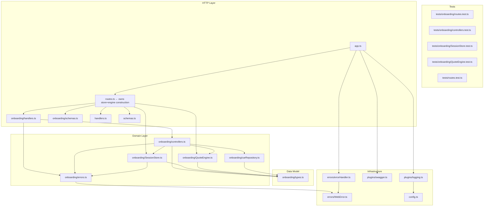
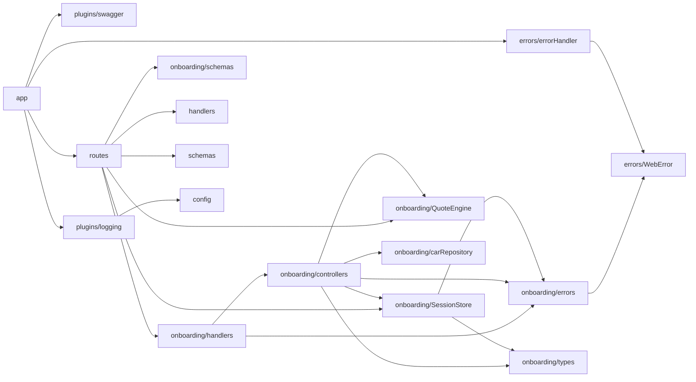
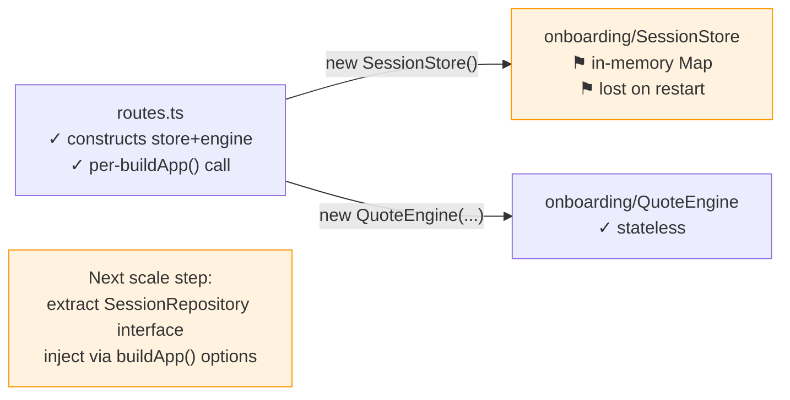

# Architecture
> Generated by /ts-code-viewer — 2026-06-03 (updated after singleton refactor)

## Layered Architecture

_Structural diagram — shows intended dependency direction by layer._

- `routes.ts` now owns `SessionStore` and `QuoteEngine` construction — each `buildApp()` call gets a fresh store (test isolation)
- `handlers.ts` only imports types from domain — no runtime domain class imports
- `types.ts` is a pure leaf — zero outbound deps
- Domain layer has zero Fastify imports — fully portable

---

## Actual Import Graph

_Exact edges from dependency-cruiser — src/ files only, node_modules collapsed._

- **No cycles, no violations** — confirmed by dependency-cruiser
- `handlers.ts` no longer imports `SessionStore` or `QuoteEngine` — only types (type-only imports are correctly excluded)
- `routes.ts` is the single point of domain object construction — clean, testable
- `QuoteEngine` and `carRepository` have zero outbound src/ deps (only type imports)

---

## Risk Map

_Clean codebase post-refactor — no cycles or violations. Remaining discussion point:_

- `SessionStore` is the only scaling bottleneck — in-memory Map, single process, lost on restart
- `QuoteEngine` is stateless — safe to share across requests; no scaling concern
- `routes.ts` construction is the right injection point for future Redis swap

---

## Module Summary

| Module | Layer | Key Exports | In-degree | Out-degree |
|---|---|---|---|---|
| `onboarding/types.ts` | Data Model | `SessionStep`, `Session`, `CarOption`, `Quote`, `ProfileBody` | 4 | 0 |
| `errors/WebError.ts` | Infra | `WebError` | 2 | 0 |
| `onboarding/QuoteEngine.ts` | Domain | `QuoteEngine`, `AgeFactor`, `CarCountFactor`, `PricingFactor`, `TotalPricingFactor` | 2 | 0 |
| `onboarding/carRepository.ts` | Domain | `getAllCars()` | 1 | 0 |
| `onboarding/errors.ts` | Domain | `SessionNotFoundError`, `SessionExpiredError`, `StepAlreadyDoneError`, `StepPrerequisiteError`, `OnboardingWebError` | 2 | 1 |
| `onboarding/SessionStore.ts` | Domain | `SessionStore` | 2 | 2 |
| `onboarding/controllers.ts` | Domain | `startSession`, `submitProfile`, `submitQuote`, `bindSession`, `getStatus` | 2 | 5 |
| `onboarding/schemas.ts` | HTTP | Fastify schemas + body/response types | 1 | 0 |
| `onboarding/handlers.ts` | HTTP | `makeOnboardingHandlers()` | 1 | 2 |
| `routes.ts` | HTTP | `registerRoutes` | 1 | 6 |
| `app.ts` | HTTP | `buildApp()` | 1 | 4 |
| `errors/errorHandler.ts` | Infra | `registerErrorHandler` | 1 | 1 |
