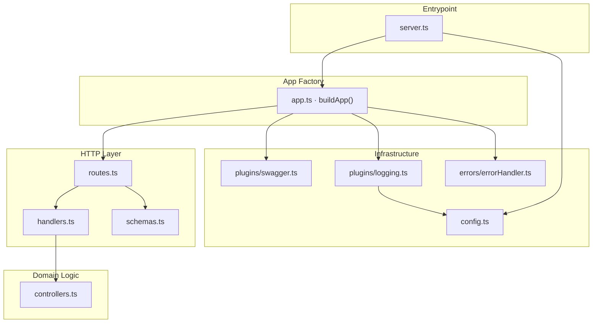
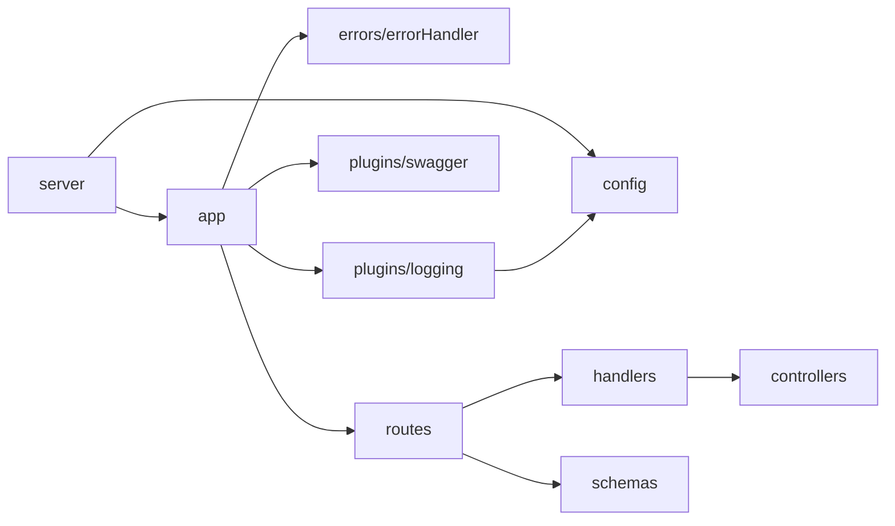
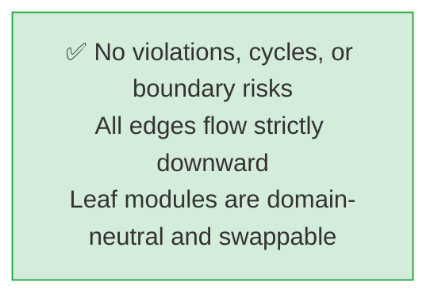

# Architecture
> Generated by /ts-code-viewer on 2026-05-31

## Layered Architecture

- Dependency direction is strictly top-down — no layer imports from above it
- `config.ts` is a leaf; the only consumer in infrastructure is `logging.ts` (and `server.ts` at startup)
- `schemas.ts` and `controllers.ts` are leaves — no internal dependencies, easy to replace on interview day
- `app.ts` is the composition root; it is the only file that knows about all infrastructure pieces

---

## Actual Import Graph

- Graph matches the layered design exactly — no violations detected
- `handlers.ts` imports only from `controllers.ts` (pure logic) and type-only from `schemas.ts`
- `plugins/swagger.ts` and `errors/errorHandler.ts` are fully isolated — zero local deps each
- No cycles found

---

## Risk Map

- **No risks found.** Import graph is clean and matches intended layering.
- The only interview-day risk is the placeholder domain in `controllers.ts` and `schemas.ts` — both are leaves and trivially replaceable.
- `handlers.ts` does not leak Fastify types into `controllers.ts` — correct boundary maintained.
- `server.ts` is excluded from tests (per `jest.config.ts`) — correct, as it opens a real port.

---

## Module Summary

| Module | Layer | Key Exports | In-degree | Out-degree |
|---|---|---|---|---|
| `server.ts` | Entrypoint | — (startup only) | 0 | 2 |
| `app.ts` | App Factory | `buildApp()` | 1 | 4 |
| `config.ts` | Infrastructure | `config: Config` | 2 | 0 |
| `plugins/swagger.ts` | Infrastructure | `registerSwagger()` | 1 | 0 |
| `plugins/logging.ts` | Infrastructure | `loggingOptions` | 1 | 1 |
| `errors/errorHandler.ts` | Infrastructure | `registerErrorHandler()` | 1 | 0 |
| `routes.ts` | HTTP | `registerRoutes()` | 1 | 2 |
| `handlers.ts` | HTTP | `getLemoHandler`, `postLemoHandler` | 1 | 1 |
| `schemas.ts` | HTTP | `postLemoBodySchema`, `getLemoSchema`, interfaces | 1 | 0 |
| `controllers.ts` | Domain | `getLemo()`, `postLemo()` | 1 | 0 |
