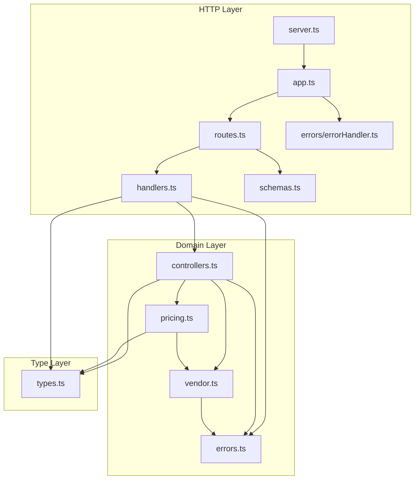
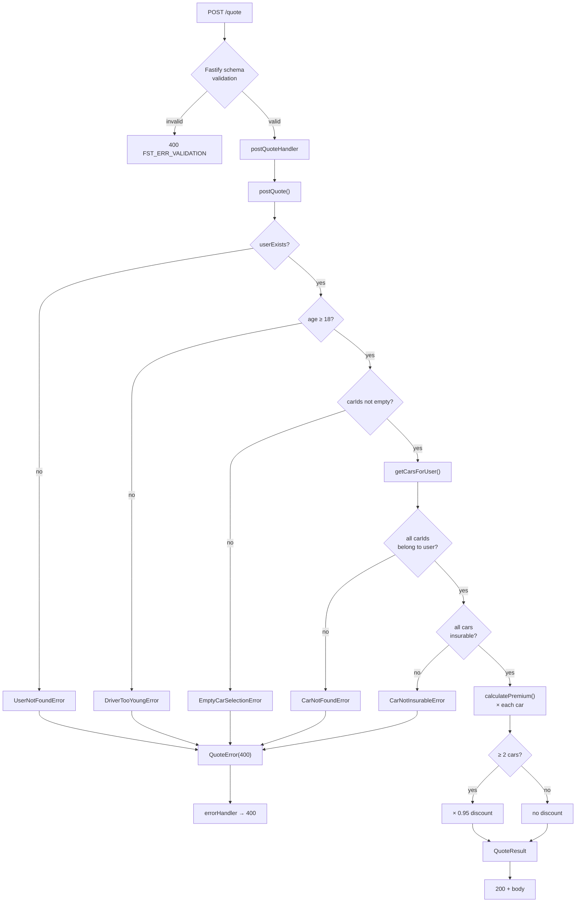
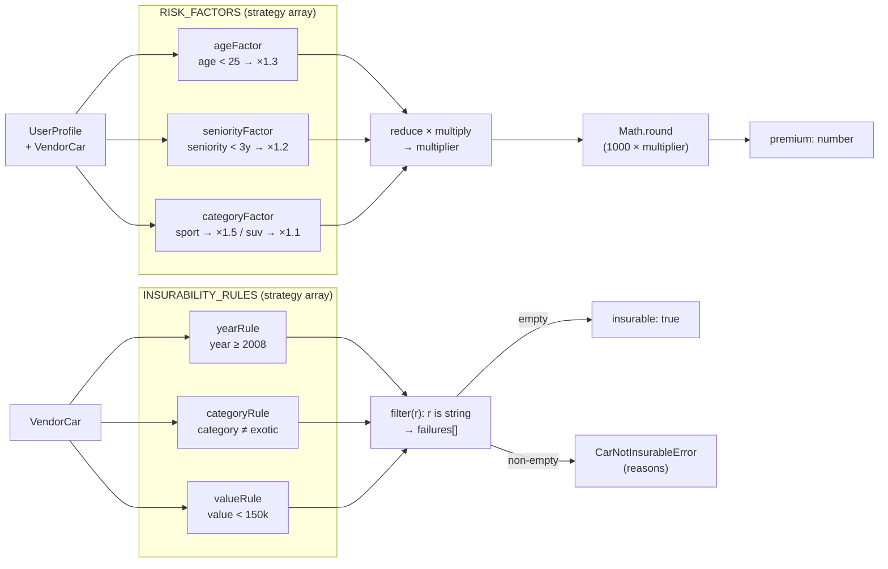

# DEBRIEF — CAR Quote Engine

## What Was Built

A Fastify REST API with two new endpoints layered on top of an existing foundation:

- `GET /cars?userId=<id>` — fetches a user's cars from an in-memory vendor and annotates each with `insurable: boolean`
- `POST /quote` — accepts a user profile and selected car IDs, validates both, and returns per-car premiums plus a combined premium with optional multi-car discount

### Module breakdown

| Module | Role |
|---|---|
| `errors.ts` | All domain error classes + `QuoteError` (HTTP translation layer) |
| `vendor.ts` | In-memory car data + `getCarsForUser`, `userExists` |
| `pricing.ts` | Risk factor strategies, insurability rules, pricing engine |
| `types.ts` | All TypeScript interfaces — domain shapes only, no runtime code |
| `schemas.ts` | Fastify JSON Schema objects — HTTP validation only |
| `controllers.ts` | All business logic — pure functions, no HTTP knowledge |
| `handlers.ts` | HTTP translation — catches domain errors, wraps in `QuoteError` |
| `routes.ts` | Route registration only |

---

## Patterns Used

### Strategy Pattern — risk factors and insurability rules

The biggest design decision. Both pricing and insurability are expressed as arrays of single-responsibility functions:

```ts
type RiskFactor = (profile: UserProfile, car: VendorCar, currentYear: number) => number;
type InsurabilityRule = (car: VendorCar) => string | null;
```

The engines (`calculatePremium`, `getInsurabilityFailures`) reduce over the arrays — they know nothing about the individual rules. Adding a new risk factor = one function + one `describe` block, zero changes to the engine or existing tests. This is the Open/Closed Principle in practice.

### Domain error → HTTP error translation

Domain errors (`DriverTooYoungError`, `CarNotInsurableError`, etc.) carry no HTTP knowledge. Handlers catch them and wrap in `QuoteError` (which carries `statusCode: 400`). `errorHandler.ts` reads `statusCode` and routes to 400 or 500. Three layers, each with a single responsibility.

### `string | null` as a lightweight Result type

`InsurabilityRule` returns `null` on pass and a failure reason string on fail. This encodes both the boolean and the reason in one return value without a wrapper type, and composes cleanly with `filter((r): r is string => r !== null)`.

### Deterministic testing via optional `currentYear`

`calculatePremium` and `postQuote` accept an optional `currentYear` parameter, defaulting to `new Date().getFullYear()`. Tests pass a fixed year — no mocking of `Date`, no module-level monkey-patching. A small design decision with a large testability payoff.

---

## Tradeoffs

### `userExists` + `getCarsForUser` double lookup

`postQuote` calls `userExists` (Set lookup) then `getCarsForUser` (Set lookup + filter) for the same userId. Two touches on the same data structure. The alternative — catching the `UserNotFoundError` from `getCarsForUser` directly — would eliminate the extra call but mix validation logic into the error-handling path. The double lookup is clearer and negligible at this scale.

### Linear scan in `getCarsForUser`

`VENDOR_CARS.filter(c => c.userId === userId)` is O(n) per request. For 5 records this is irrelevant. In production, pre-indexing into a `Map<string, VendorCar[]>` at module load time would make it O(1). Not done here — YAGNI for a simulated vendor.

### `EmptyCarSelectionError` is unreachable via HTTP

Fastify's JSON Schema declares `carIds` with `minItems: 1`, so an empty array is rejected before the controller runs. The error class and guard exist for unit-test completeness and as a safety net if the route is ever called without schema validation. A documented tradeoff.

### `types.ts` imports from `vendor.ts`

`InsurableCar extends VendorCar` creates a dependency from the type layer to the data layer. Purists would define `VendorCar` in `types.ts` and import it into `vendor.ts`. For this assignment scope the current direction is acceptable and avoids a circular dependency.

---

## What I'd Change With More Time

1. **Pre-index vendor data** — build a `Map<string, VendorCar[]>` at module load for O(1) `getCarsForUser` lookups.
2. **Move `VendorCar` to `types.ts`** — clean up the `types.ts` → `vendor.ts` dependency.
3. **Inject `getCarsForUser` into controllers** — replace module-level import with a parameter so handlers are testable without `jest.spyOn(require(...))`.
4. **Extract tunable pricing constants to config** — `BASE_PREMIUM`, `MIN_INSURABLE_YEAR`, `MAX_INSURABLE_VALUE`, `MULTI_CAR_DISCOUNT_FACTOR` are business rules that a product team might change per market without a code deploy.
5. **Add `noUncheckedIndexedAccess: true`** to `tsconfig.json` — forces guarding of array index access, catching a class of runtime errors at compile time.

---

## Lessons Learned

- **Name the pattern in the interview.** Calling it "strategy pattern" when presenting `RISK_FACTORS` is the difference between describing code and demonstrating design awareness.
- **Validation ordering is a security signal.** Checking `userId` before `age` prevents information leakage (error type reveals whether a user exists). Interviewers notice this.
- **`readonly` at every level matters.** `readonly carIds: string[]` is not the same as `readonly carIds: readonly string[]`. The first only prevents reassignment; the second prevents mutation of contents.
- **`filter(Boolean) as string[]` is a lie.** Type predicates (`filter((r): r is string => r !== null)`) let the compiler verify the narrowing rather than trust a cast.
- **Separate types from schemas from logic.** Three files, three jobs: `types.ts` (interfaces), `schemas.ts` (Fastify validation), domain modules (pure functions). Mixing them creates import tangles and makes the codebase harder to navigate.

---

## Diagrams

### 1 — Layered Architecture

Dependency direction is strictly downward — no Domain module imports from HTTP, no Type module imports from Domain.



- `handlers.ts` is the only module bridging HTTP and Domain — the right place for `QuoteError` wrapping.
- `errors.ts` is the one sanctioned upward reference: `QuoteError` is the translation object that crosses into the HTTP layer.
- `schemas.ts` depends on nothing — pure JSON Schema objects, no domain knowledge.

---

### 2 — `POST /quote` Request Flow

Traces one request from HTTP entry to response, showing every validation gate and error branch.



- Two validation gates: Fastify schema (structural) fires before the controller (business rules) — intentionally separate.
- Validation order `userId → age → carIds → ownership → insurability` prevents error-type leakage.
- All domain errors converge at `QuoteError` — `errorHandler` only needs to check `statusCode`.

---

### 3 — Pricing Engine Internals

Shows how the strategy arrays compose to produce a premium — the key pattern to name in the interview.



- Adding a risk factor = one function + one test, zero engine changes — Open/Closed Principle, name it explicitly.
- `readonly RiskFactor[]` prevents test pollution — no test can `.push()` an extra factor that bleeds into subsequent tests.
- Type predicate `filter((r): r is string => r !== null)` — compiler verifies the narrowing, no silent cast.
