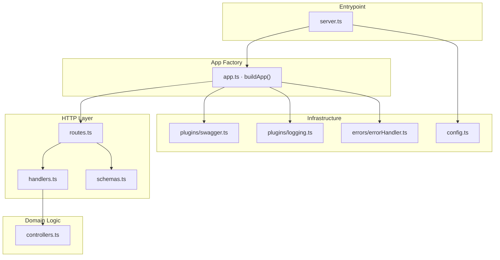
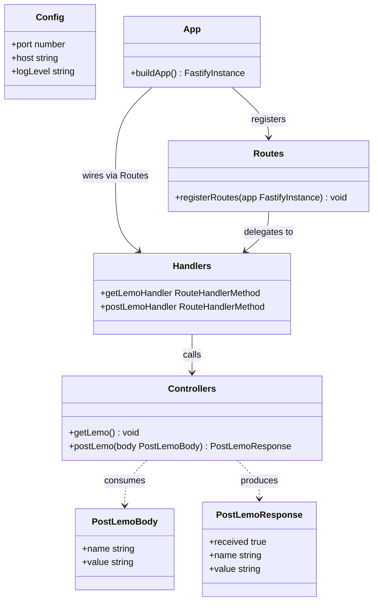
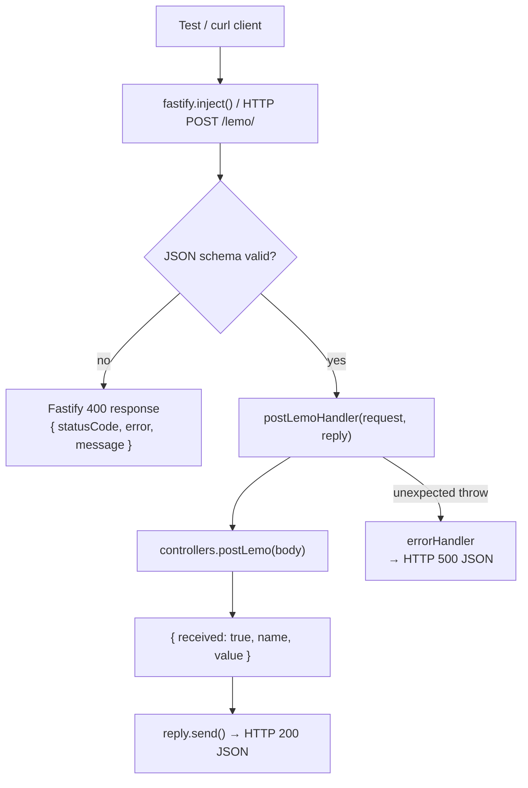

# DESIGN

> Status: pre-implementation

## Interview-Day Adaptation Checklist

When the real prompt arrives, review and update these before writing any new code:

**Routes**
- [ ] Confirm route paths — currently `GET /lemo` and `POST /lemo`; rename if the prompt differs
- [ ] Confirm `GET /lemo` truly returns 200 with no body, or add a response schema if it returns data

**Schemas (`src/schemas.ts`)**
- [ ] Replace `PostLemoBody` fields (`name`, `value`) with the actual request body fields
- [ ] Replace `PostLemoResponse` shape (`received`, `name`, `value`) with the actual response shape
- [ ] Decide whether empty strings / whitespace are valid inputs — update `postLemoBodySchema` accordingly (e.g. add `minLength`)
- [ ] Add/remove `additionalProperties: false` based on whether the prompt requires strict input

**Controllers (`src/controllers.ts`)**
- [ ] Replace `postLemo` logic with the real business logic
- [ ] Remove `getLemo` if the GET route changes behavior or is dropped

**Tests to revisit**
- [ ] `tests/controllers.test.ts` — remove empty-string and whitespace edge cases if the schema rejects them upstream; add cases for the real business logic
- [ ] `tests/handlers.test.ts` — update expected `reply.send()` payloads to match new response shape
- [ ] `tests/routes.test.ts` — update request bodies and expected response bodies throughout
- [ ] Delete any test that was written for placeholder behavior that no longer applies

## Module Breakdown

| Module | Responsibility | Exports |
|---|---|---|
| `config.ts` | Reads and validates env vars; single source of `process.env` access | `config` (typed object) |
| `schemas.ts` | JSON schemas for request/response payloads + TypeScript interfaces | `postLemoBodySchema`, `postLemoResponseSchema`, `PostLemoBody`, `PostLemoResponse` |
| `controllers.ts` | Pure app logic; no Fastify types | `getLemo()`, `postLemo()` |
| `handlers.ts` | Fastify-facing thin wrappers; bridges controllers to request/reply | `getLemoHandler`, `postLemoHandler` |
| `routes.ts` | Registers routes with schemas attached | `registerRoutes(app)` |
| `plugins/swagger.ts` | Registers `@fastify/swagger` + `@fastify/swagger-ui` | `registerSwagger(app)` |
| `plugins/logging.ts` | Configures request logging and request-id | `loggingOptions` (Fastify server options fragment) |
| `errors/errorHandler.ts` | Centralized `setErrorHandler` for non-validation failures | `registerErrorHandler(app)` |
| `app.ts` | `buildApp()` factory — wires all plugins, routes, error handler | `buildApp()` |
| `server.ts` | Network listener entrypoint — calls `buildApp()` then `listen()` | (entrypoint, no exports) |

## Function / Class Signatures

```ts
// config.ts
interface Config { port: number; host: string; logLevel: string; }
const config: Config  // singleton export

// schemas.ts
const postLemoBodySchema: FastifySchema
const postLemoResponseSchema: FastifySchema
interface PostLemoBody { name: string; value: string }
interface PostLemoResponse { received: true; name: string; value: string }

// controllers.ts
function getLemo(): void          // no return value; GET /lemo returns 200 with empty body
function postLemo(body: PostLemoBody): PostLemoResponse

// handlers.ts
const getLemoHandler: RouteHandlerMethod
const postLemoHandler: RouteHandlerMethod

// routes.ts
function registerRoutes(app: FastifyInstance): void

// plugins/swagger.ts
async function registerSwagger(app: FastifyInstance): Promise<void>

// plugins/logging.ts
const loggingOptions: FastifyServerOptions['logger']

// errors/errorHandler.ts
function registerErrorHandler(app: FastifyInstance): void

// app.ts
async function buildApp(): Promise<FastifyInstance>
```

## Data Flow

1. `server.ts` calls `buildApp()` then `app.listen({ port, host })`
2. `buildApp()` creates Fastify instance with logging options from `plugins/logging.ts`
3. `buildApp()` registers Swagger plugins via `plugins/swagger.ts`
4. `buildApp()` registers routes via `routes.ts` (schemas attached at registration)
5. `buildApp()` registers error handler via `errors/errorHandler.ts`
6. On `GET /lemo`: handler calls `getLemo()` → replies 200 with no body
7. On `POST /lemo`: Fastify validates body against `postLemoBodySchema` → handler calls `postLemo(body)` → returns `{ received: true, name, value }`
8. On validation failure: Fastify default 400 response (no custom handling needed)
9. On unexpected error: `errorHandler` catches, logs, returns `{ statusCode, error, message }`

## Implementation Checklist

### Must-Have
- [ ] `config.ts` — env parsing, defaults, typed export
- [ ] `schemas.ts` — JSON schemas + TS interfaces for POST route
- [ ] `controllers.ts` — `getLemo()`, `postLemo()`
- [ ] `handlers.ts` — `getLemoHandler`, `postLemoHandler`
- [ ] `routes.ts` — route registration with schemas
- [ ] `plugins/swagger.ts` — OpenAPI + Swagger UI at `/docs`
- [ ] `plugins/logging.ts` — request logging + request-id
- [ ] `errors/errorHandler.ts` — centralized error handler
- [ ] `app.ts` — `buildApp()` factory
- [ ] `server.ts` — entrypoint
- [ ] `tests/app.test.ts`
- [ ] `tests/routes.test.ts`
- [ ] `tests/handlers.test.ts`
- [ ] `tests/controllers.test.ts`
- [ ] `tests/config.test.ts`
- [ ] `scripts/curl-get.sh`
- [ ] `scripts/curl-post.sh`
- [ ] `package.json`, `tsconfig.json`, `jest.config.ts`, `.env.example`, `.gitignore`

### Nice-to-Have
- [ ] `tests/errorHandler.test.ts` — isolated error handler behavior

---

## Pre-Implementation Diagrams

### 1. Layered Architecture (planned)



### 2. Planned Class Diagram



### 3. Planned Call Flow — POST /lemo/


