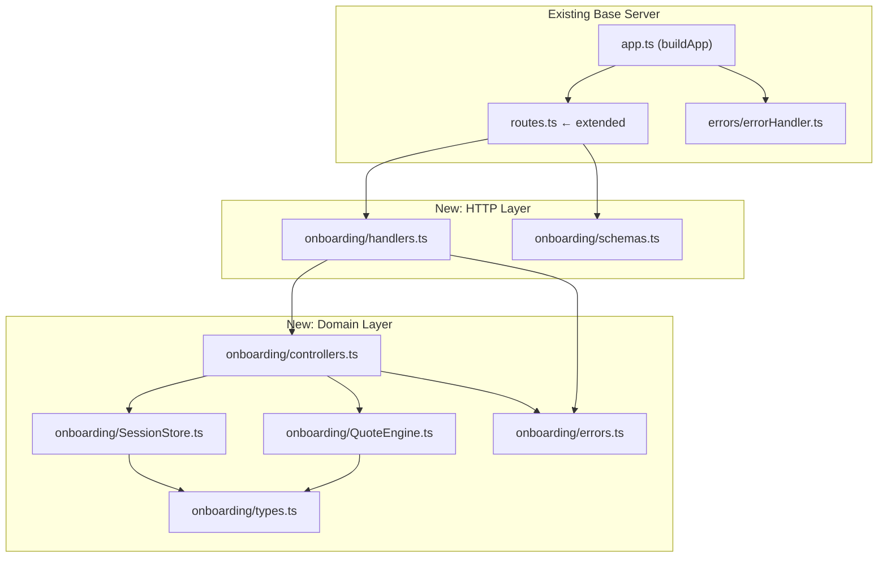
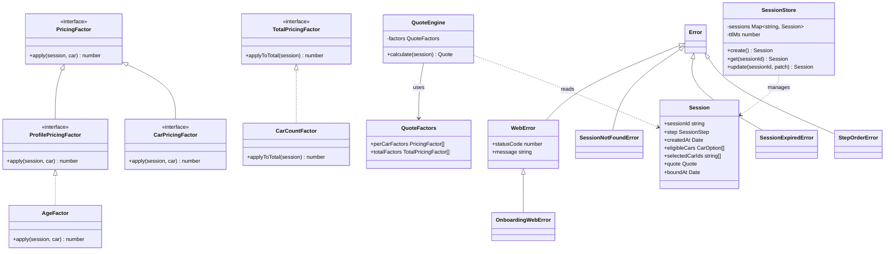
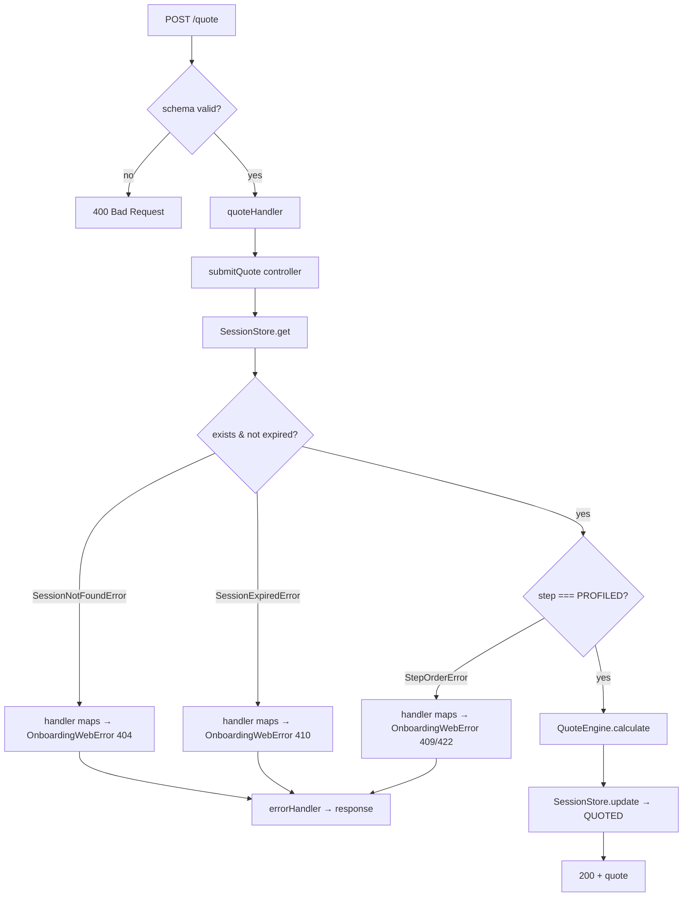

# DESIGN — Onboarding Flow API

## 1. Module Breakdown

| Module | Responsibility | Exports |
|---|---|---|
| `src/routes.ts` | Extended with 5 onboarding routes alongside existing `/lemo` | `registerRoutes` (extended) |
| `src/onboarding/handlers.ts` | Thin Fastify handlers — extract body/params, call controller, map domain errors to HTTP, send reply | `startHandler`, `profileHandler`, `quoteHandler`, `bindHandler`, `statusHandler` |
| `src/onboarding/controllers.ts` | Orchestration — step guards, eligibility filtering, QuoteEngine calls; no Fastify types | `startSession`, `submitProfile`, `submitQuote`, `bindSession`, `getStatus` |
| `src/onboarding/schemas.ts` | Fastify JSON schemas + TypeScript body/response types for all 5 endpoints | `StartResponse`, `ProfileBody`, `QuoteBody`, all schema objects |
| `src/onboarding/types.ts` | Domain types and enums | `SessionStep`, `Session`, `CarOption`, `Quote` |
| `src/onboarding/SessionStore.ts` | In-memory session CRUD + TTL enforcement; throws plain domain errors (no HTTP knowledge) | `SessionStore` class |
| `src/onboarding/QuoteEngine.ts` | Pricing via Strategy Pattern with typed factor hierarchy | `QuoteEngine`, `QuoteFactors`, `PricingFactor`, `ProfilePricingFactor`, `CarPricingFactor`, `TotalPricingFactor`, `AgeFactor`, `CarCountFactor` |
| `src/onboarding/errors.ts` | Domain errors + onboarding HTTP error (extends base `WebError`) | `SessionNotFoundError`, `SessionExpiredError`, `StepOrderError`, `OnboardingWebError` |

## 2. Key Signatures

### `SessionStore`
```ts
class SessionStore {
  constructor(options?: { ttlMs?: number })
  create(): Session
  get(sessionId: string): Session        // throws SessionNotFoundError | SessionExpiredError
  update(sessionId: string, patch: Partial<Session>): Session  // throws SessionNotFoundError
}
```

### Controllers (pure domain — no Fastify types)
```ts
function startSession(store: SessionStore): Session
function submitProfile(store: SessionStore, sessionId: string, body: ProfileBody): Session
function submitQuote(store: SessionStore, engine: QuoteEngine, sessionId: string, body: QuoteBody): Session
function bindSession(store: SessionStore, sessionId: string): Session
function getStatus(store: SessionStore, sessionId: string): Session
```

### Handlers (thin — extract params, call controller, map errors)
```ts
async function profileHandler(
  request: FastifyRequest<{ Params: { sessionId: string }; Body: ProfileBody }>,
  reply: FastifyReply
): Promise<void>
// catches SessionNotFoundError → OnboardingWebError(404)
// catches SessionExpiredError  → OnboardingWebError(410)
// catches StepOrderError       → OnboardingWebError(409 | 422)
```

### `QuoteEngine`
```ts
interface PricingFactor {
  apply(session: Session, car: CarOption): number  // base — per-car factors
}
interface ProfilePricingFactor extends PricingFactor {}  // reads session.profile; ignores car
interface CarPricingFactor extends PricingFactor {}      // reads car; profile may be ignored

interface TotalPricingFactor {
  applyToTotal(session: Session): number  // applies to summed total, not per-car
}
interface QuoteFactors {
  perCarFactors: PricingFactor[]
  totalFactors: TotalPricingFactor[]
}

class AgeFactor implements ProfilePricingFactor {
  apply(session: Session, _car: CarOption): number
}
class CarCountFactor implements TotalPricingFactor {
  applyToTotal(session: Session): number
}
class QuoteEngine {
  constructor(factors: QuoteFactors)
  calculate(session: Session): Quote
}
```

### Errors
```ts
// src/onboarding/errors.ts — domain only, no HTTP knowledge
class SessionNotFoundError extends Error {}
class SessionExpiredError extends Error {}
class StepOrderError extends Error {}

// src/errors/WebError.ts — base server, HTTP layer only
class WebError extends Error {
  constructor(public readonly statusCode: number, message: string)
}

// src/onboarding/errors.ts — onboarding HTTP error, extends base WebError
class OnboardingWebError extends WebError {}
```

## 3. Data Flow

1. Request hits Fastify — JSON schema validation runs automatically (400 on failure)
2. Handler extracts `sessionId` + body, calls controller function
3. Controller calls `SessionStore.get()` — throws `SessionNotFoundError` or `SessionExpiredError` if missing/expired
4. Controller checks `session.step` — throws `StepOrderError` if out of order
5. Controller executes domain logic (filter eligibility / call QuoteEngine / set boundAt)
6. Controller calls `SessionStore.update()` to persist state change, returns updated session
7. Handler receives result, sends reply — or catches domain error and re-throws as `OnboardingWebError` with correct HTTP status
8. `errorHandler` catches `OnboardingWebError` (via `instanceof WebError`) → returns `{ statusCode, error, message }`

## 4. Scaling Analysis

| Component / Decision | Current approach | Scale limit | Path to scale |
|---|---|---|---|
| Session store | In-memory `Map<string, Session>` | Single process; ~100k sessions before GC pressure; lost on restart | Extract behind `SessionRepository` interface; swap with Redis — controllers don't change |
| TTL enforcement | Passive check per request | Expired sessions linger in memory if never accessed again | Add `setInterval` sweep, or use native Redis TTL |
| Car catalogue | Hard-coded array in module scope | Fine for interview scale | Inject as dependency into controllers; replace with DB/API call |
| QuoteEngine factors | Sync, in-process multipliers | Not a scaling concern | Not a scaling concern |
| Step ordering guard | Enum comparison, O(1) | Not a scaling concern | Not a scaling concern |

## 5. Implementation Checklist

### Must-have
- [ ] `src/onboarding/errors.ts` — `SessionNotFoundError`, `SessionExpiredError`, `StepOrderError`, `OnboardingWebError`
- [ ] `src/onboarding/types.ts` — `SessionStep`, `Session`, `CarOption`, `Quote`
- [ ] `src/onboarding/schemas.ts` — Fastify schemas + body/response types
- [ ] `src/onboarding/SessionStore.ts` — `create`, `get`, `update` with TTL; throws plain domain errors
- [ ] `src/onboarding/QuoteEngine.ts` — `PricingFactor`, `ProfilePricingFactor`, `CarPricingFactor`, `TotalPricingFactor`, `QuoteFactors`, `AgeFactor`, `CarCountFactor`, `QuoteEngine`
- [ ] `src/onboarding/controllers.ts` — `startSession`, `submitProfile`, `submitQuote`, `bindSession`, `getStatus`
- [ ] `src/onboarding/handlers.ts` — thin handlers, error mapping
- [ ] `src/routes.ts` — extended with 5 onboarding routes
- [ ] `tests/onboarding/SessionStore.test.ts` — unit tests
- [ ] `tests/onboarding/QuoteEngine.test.ts` — unit tests
- [ ] `tests/onboarding/controllers.test.ts` — unit tests for step logic
- [ ] `tests/onboarding/routes.test.ts` — integration tests via `fastify.inject()`

### Nice-to-have
- [ ] OpenAPI tags for onboarding routes

## 6. Pre-Implementation Diagrams

### Layered Architecture (planned)



### Planned Class Diagram



### Planned Call Flow — POST /onboarding/:sessionId/quote


