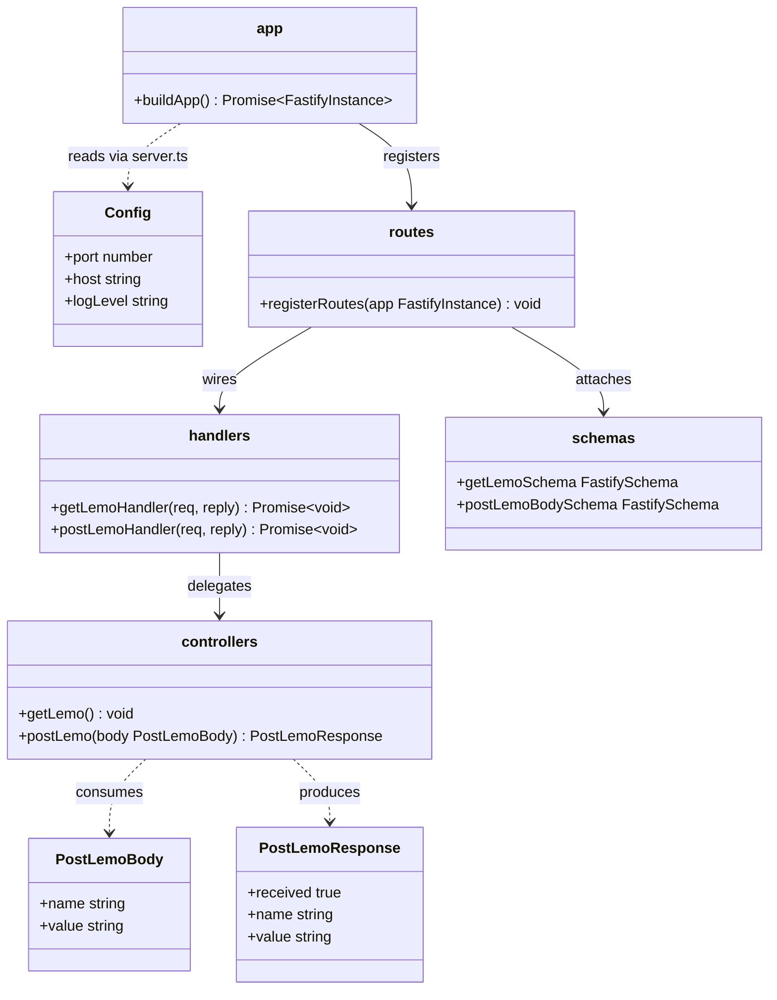
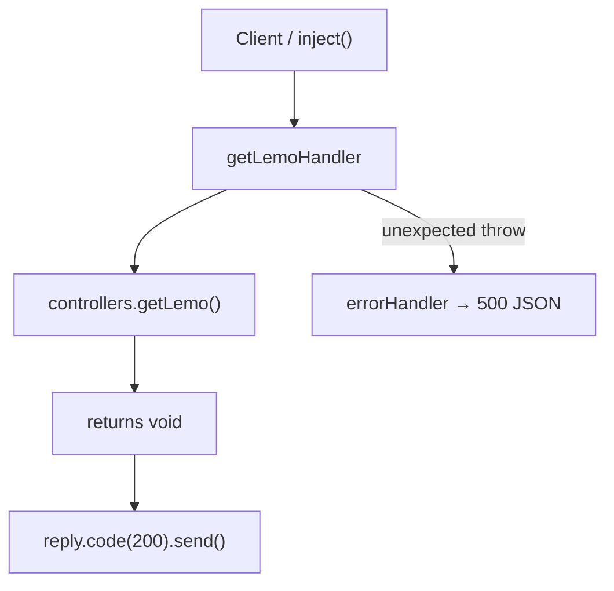
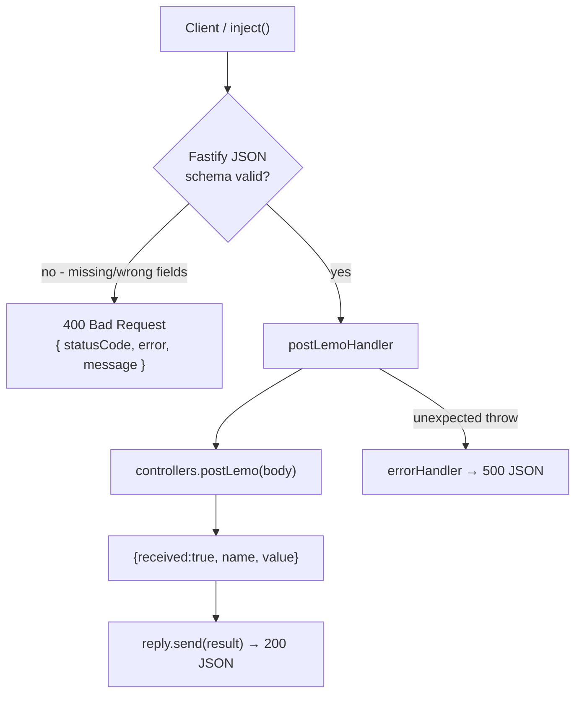
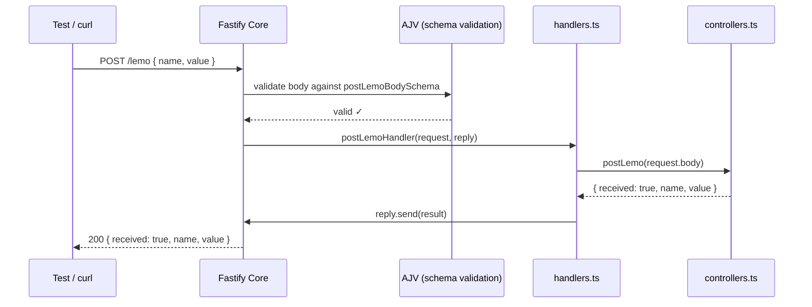
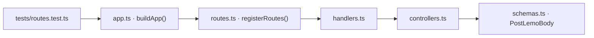
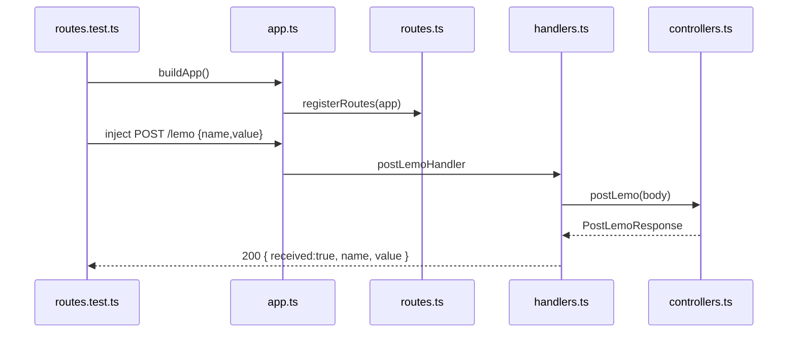
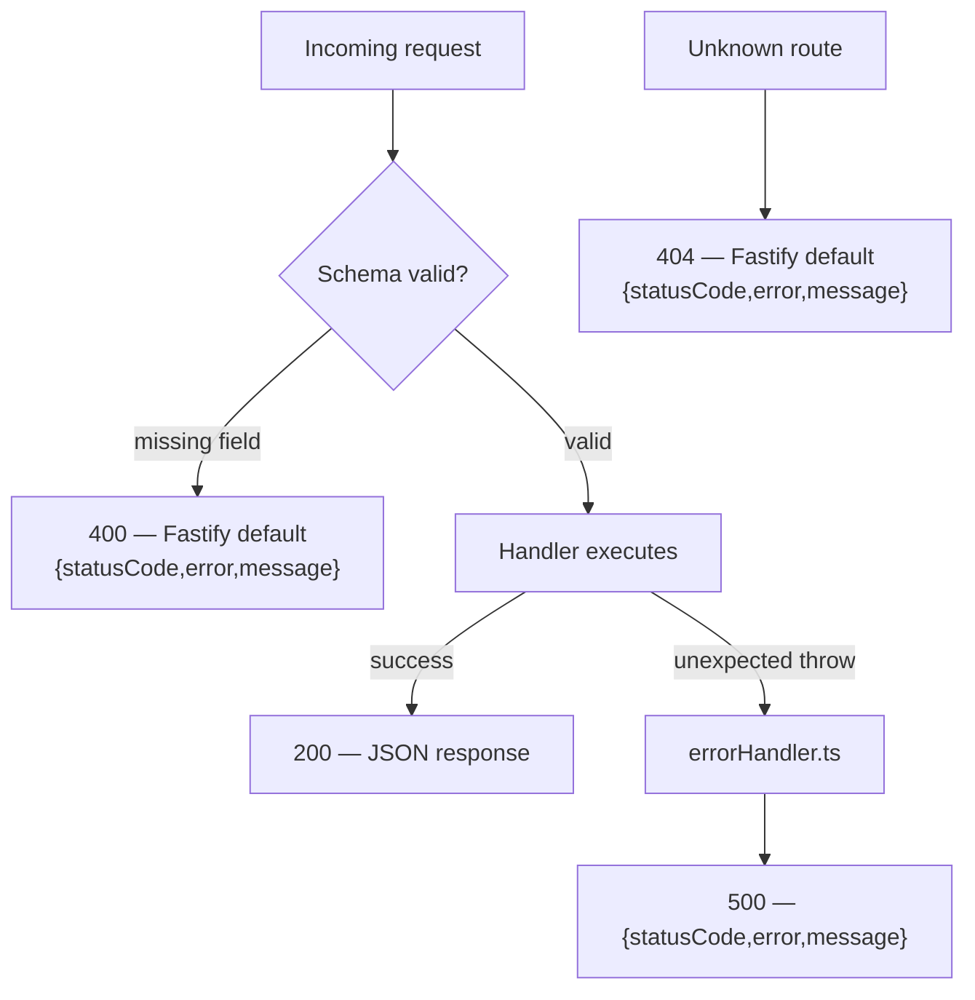
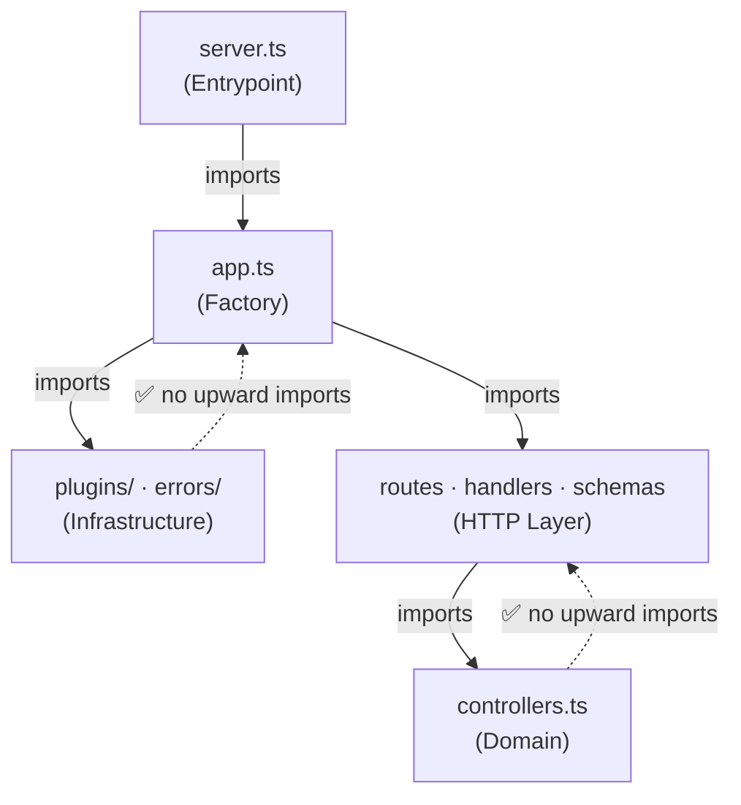

# Internals
> Generated by /ts-code-viewer on 2026-05-31

## Class Diagram

- `handlers.ts` is the center of gravity for HTTP concerns — it bridges Fastify types to pure logic
- `controllers.ts` has zero Fastify imports — correct boundary, makes unit testing trivial
- `schemas.ts` is the single source of truth for both validation and OpenAPI output
- No class is too broad; each module is ≤2 exported functions

---

## Call-Flow: getLemoHandler

- `getLemo()` is intentionally a no-op for the placeholder — replace with real logic on interview day
- `reply.code(200).send()` with no argument produces an empty 200 body, as required
- Error path goes to `setErrorHandler` — the handler itself has no try/catch

---

## Call-Flow: postLemoHandler

- Validation happens before the handler is called — handlers never see invalid bodies
- `postLemo()` is a pure function with no side effects — safe to unit-test without mocks
- Extra fields are silently stripped by AJV (`removeAdditional` is Fastify's default)

---

## Sequence: Main Path — POST /lemo

---

## Review Slices

### 1. Entry-Point Slice
**Review question:** Does the public entry point stay thin and delegate correctly?

- `buildApp()` is the only entry point used in tests — no real port opened
- Each layer adds exactly one concern: wiring → HTTP bridge → pure logic
- `schemas.ts` is imported only by `routes.ts` (for attachment) and type-only in `handlers.ts`
- **Clean:** no test directly imports controllers or handlers — all HTTP behavior tested via `inject()`

---

### 2. Success-Path Slice
**Review question:** Does the happy path flow cleanly through all layers with no leakage?

- No shared mutable state — `postLemo()` is a pure function
- Response shape is determined in `controllers.ts`, not in `handlers.ts` — correct separation
- **Clean:** Fastify types never leak below `handlers.ts`

---

### 3. Failure-Path Slice
**Review question:** Are all failure branches handled and returning consistent error shapes?

- All error shapes use the same `{ statusCode, error, message }` envelope — consistent for API consumers
- 400 (validation) is handled by Fastify's built-in AJV pipeline — no custom code needed
- 500 (unexpected) is handled by `registerErrorHandler` in `errors/errorHandler.ts`
- `errorHandler` intentionally does NOT catch 400s — letting Fastify's default flow through keeps error shapes consistent

---

### 4. Boundary-Risk Slice
**Review question:** Are layer boundaries clean — do lower layers ever import from higher layers?

- **No boundary violations.** All imports flow strictly downward.
- `controllers.ts` imports zero Fastify types — domain logic is framework-agnostic
- `config.ts` is imported only by `plugins/logging.ts` and `server.ts` — not scattered across layers
- **Worth noting in interview:** this boundary discipline means swapping Fastify for Express would only touch `handlers.ts`, `routes.ts`, `app.ts`, and the plugins — domain logic survives intact
