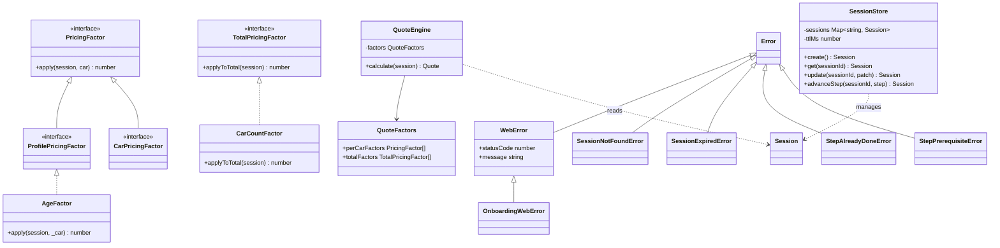
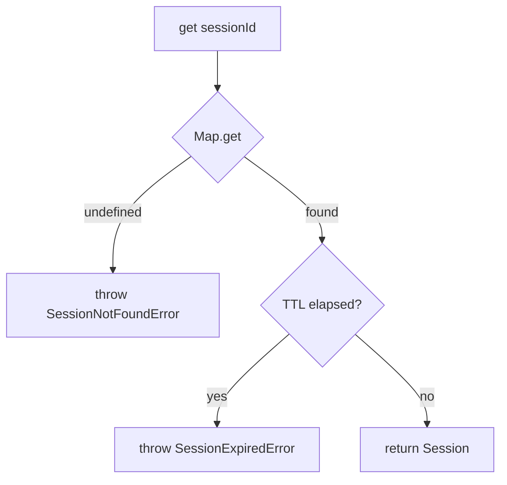
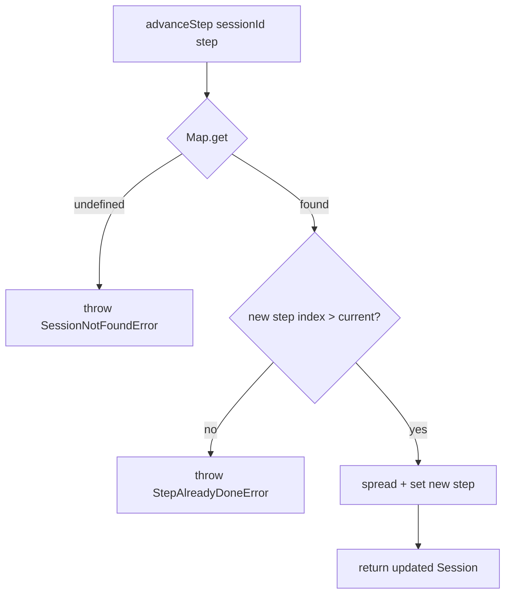
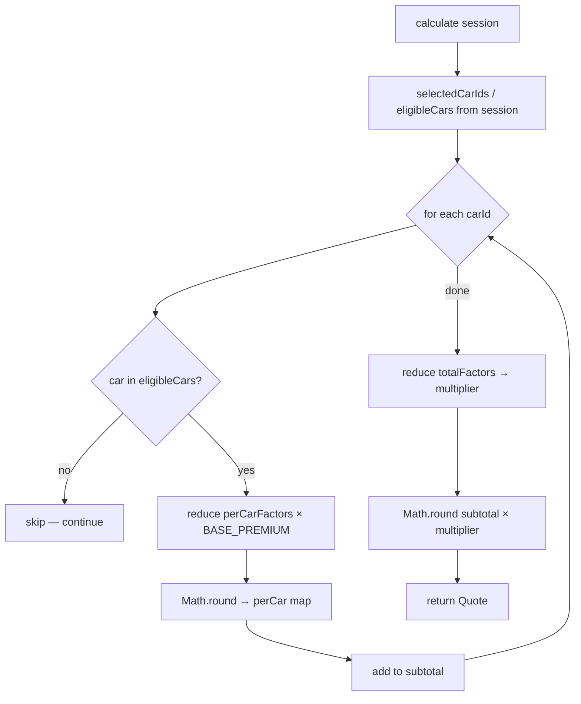
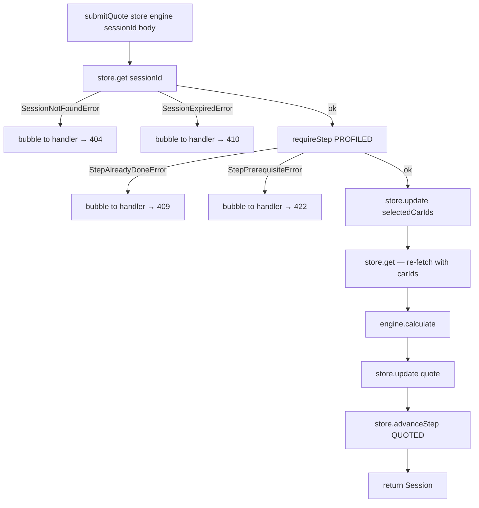
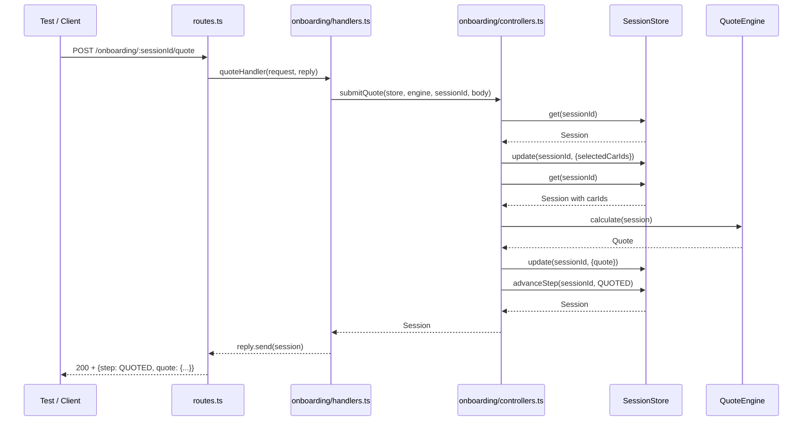
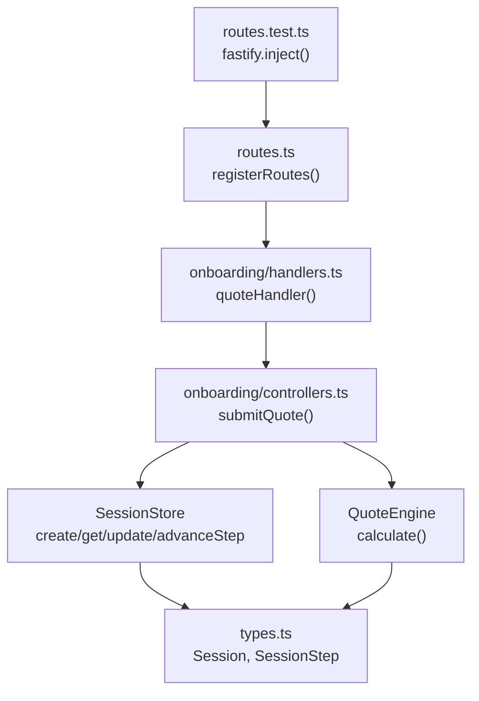
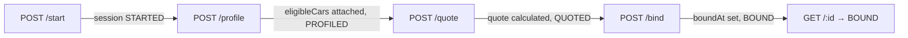
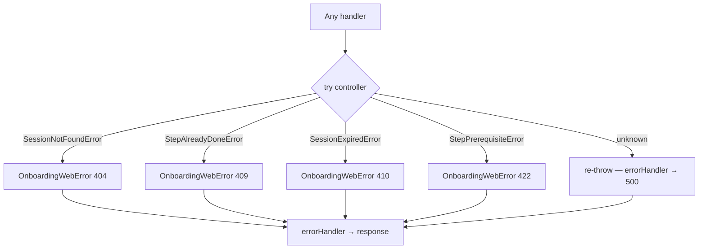
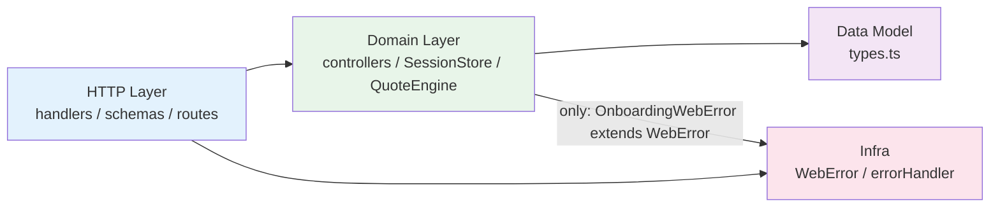

# Internals
> Generated by /ts-code-viewer — 2026-06-03

## Class Diagram

_Structural — shows full exported API surface of the onboarding domain._

- **Center of gravity:** `SessionStore` — all 5 controller functions pass through it
- **QuoteEngine** is deliberately narrow — reads session, returns Quote, no side effects
- **Error hierarchy** is the most interesting design choice — 4 domain errors + 1 HTTP error, clean separation
- `update()` type-restricts patch with `Omit<..., 'sessionId'|'createdAt'|'step'>` — immutable identity fields enforced by the type system

---

## Call-Flow: SessionStore.get

## Call-Flow: SessionStore.advanceStep

## Call-Flow: QuoteEngine.calculate

## Call-Flow: controllers.submitQuote

---

## Sequence: Full Happy Path (POST /quote)

---

## Review Slices

### 1. Entry-Point Slice

**Review question:** Is the public API surface minimal and correctly layered?

- Tests only import `buildApp()` — no test reaches into domain directly via routes
- Route registration is the only place that knows about URL patterns
- Handlers are the only layer that knows about HTTP status codes (via `mapDomainError`)
- Controllers are pure functions — no Fastify types anywhere in domain

### 2. Success-Path Slice

**Review question:** Does the happy path flow cleanly without unnecessary steps?

- Each step is idempotent within a session — the store is the source of truth
- `submitQuote` calls `store.get()` twice — once to check step, once after update to pass fresh session to engine. Slight overhead, but keeps logic explicit.

### 3. Failure-Path Slice

**Review question:** Are all error branches handled consistently?

- `mapDomainError` is defined once in `handlers.ts` and called in every handler — DRY, consistent
- Unknown errors re-throw, hitting the Fastify `errorHandler` → 500 — no silent swallowing
- The 409/422 distinction is encoded in two distinct error classes, not a string check

### 4. Boundary-Risk Slice

**Review question:** Are there any cross-layer violations or unexpected dependencies?

- **Clean boundary** — domain only crosses into infra for `OnboardingWebError extends WebError`, which is intentional by design
- Domain has zero Fastify imports — fully portable
- The one discussion point: `SessionStore` and `QuoteEngine` singletons in `handlers.ts`. At scale, move construction to `buildApp()` and pass via Fastify decorators
