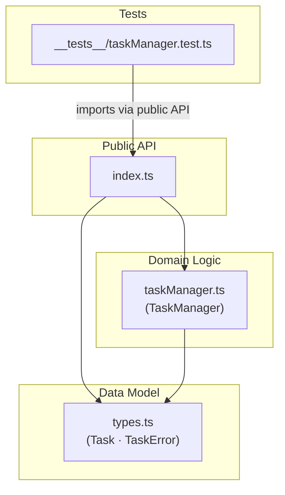
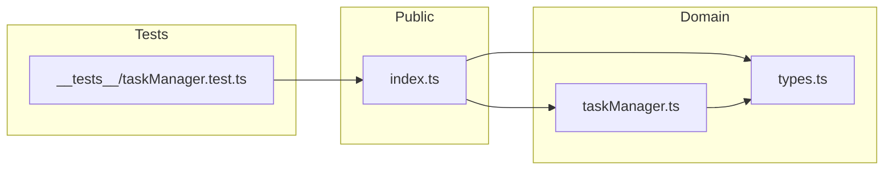
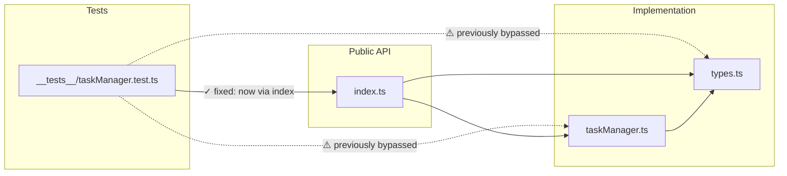

# Architecture

> Generated by `/ts-code-viewer` on 2026-05-31.
> Diagrams are structural (static imports), not behavioral.
> View in VS Code with `Cmd+Shift+V`, or paste blocks into [mermaid.live](https://mermaid.live).

---

## Layered Architecture

Shows the intended layer structure and dependency direction.

- Dependency direction is strictly inward: Tests → Public API → Domain → Model.
- `types.ts` is a pure leaf — no outgoing imports. Ideal for a data-model layer.
- `index.ts` acts as the enforced public boundary; nothing inside the domain leaks out directly.
- Adding a persistence layer later would sit between Domain and a new Infra subgraph without touching existing layers.

---

## Actual Import Graph

Exact edges as observed by dependency-cruiser (4 modules, 4 edges, 0 violations).

- Clean DAG — zero cycles detected.
- `types.ts` has the highest in-degree (2 direct dependents: `index`, `taskManager`).
- `index.ts` is the single entry point for the test layer — boundary is enforced.
- No cross-layer violations reported by dependency-cruiser.

---

## Risk Map

Current state: no active violations. Diagram shows the pre-fix state for interview discussion.

- Dashed edges show the pre-fix imports (tests reaching directly into implementation files).
- Solid edge shows the corrected import path through `index.ts`.
- Fixed in commit `90842a2` — tests now import from `../index` only.
- **Current state is clean** — this diagram is for interview discussion only.

---

## Module Summary

| Module | Layer | Exports | In-degree | Out-degree |
|---|---|---|---|---|
| `types.ts` | Data Model | `Task`, `TaskError` | 2 | 0 |
| `taskManager.ts` | Domain Logic | `TaskManager` | 1 (`index.ts`) | 1 (`types.ts`) |
| `index.ts` | Public API | re-exports all | 1 (tests) | 2 |
| `__tests__/taskManager.test.ts` | Tests | — | 0 (leaf) | 1 (`index.ts`) |
