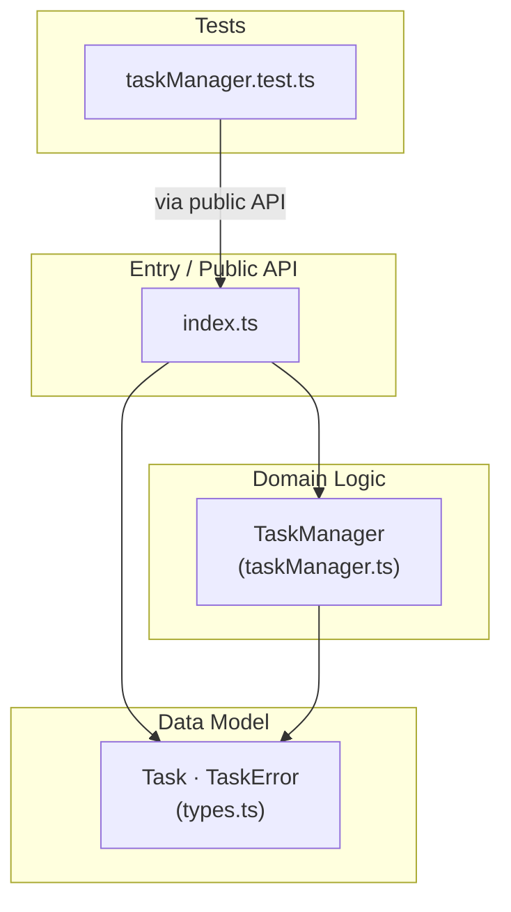
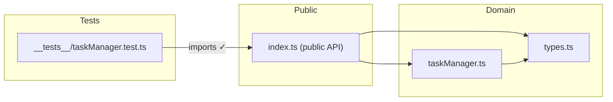
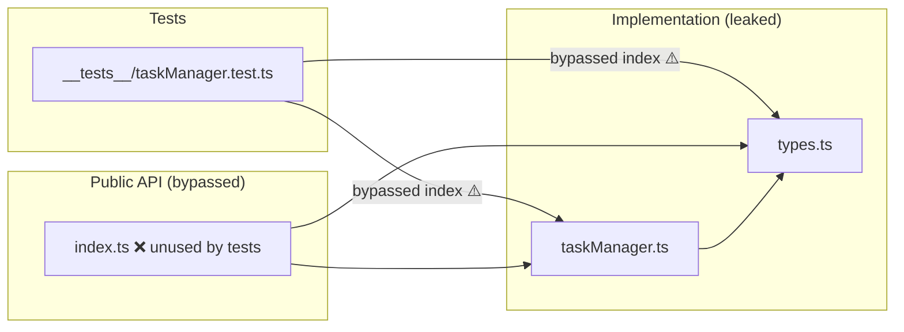

# Architecture

## Layered Architecture

Shows the three-layer model: public API → domain logic → data model.

- `types.ts` is a pure leaf — no outgoing imports, ideal for a data-model layer.
- `index.ts` is the enforced public boundary — tests import only from here, not from implementation files directly.
- Adding persistence later would sit between domain logic and a new infra layer without changing the existing layers.

---

## Actual Import Graph

Exact imports as observed by dependency-cruiser.

- Clean DAG — zero cycles.
- `types.ts` has in-degree 3 (highest centrality) — changes to `Task` or `TaskError` affect all modules.
- No cross-boundary violations detected.

---

## Risk Map (Before Boundary Fix)

What the graph looked like before tests were fixed to import through `index.ts`.

- Tests reached past `index.ts` directly into implementation files.
- `index.ts` had in-degree 0 — the boundary existed but was not enforced.
- Fixed in commit `90842a2`: test imports now go through `../index`.

---

## Module Summary

| Module | Layer | Exports | Dependents |
|---|---|---|---|
| `types.ts` | Data Model | `Task`, `TaskError` | 3 (all modules) |
| `taskManager.ts` | Domain Logic | `TaskManager` | 2 (`index`, tests via index) |
| `index.ts` | Public API | re-exports all | 1 (tests) |
| `__tests__/taskManager.test.ts` | Tests | — | 0 (leaf) |
