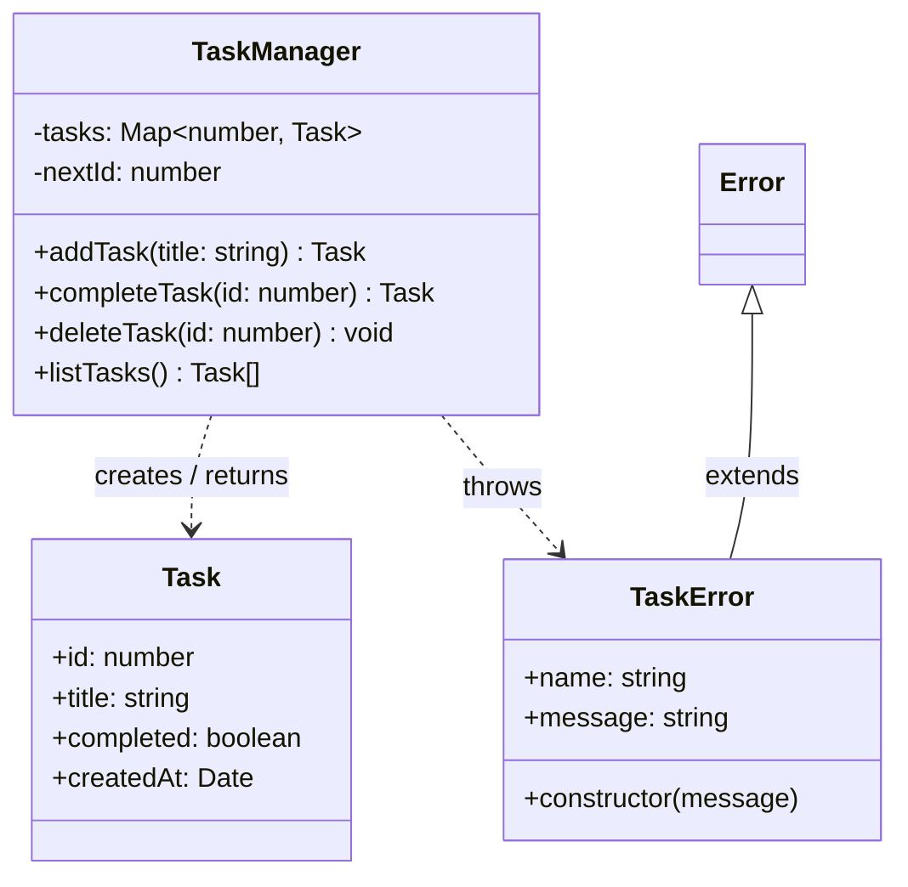
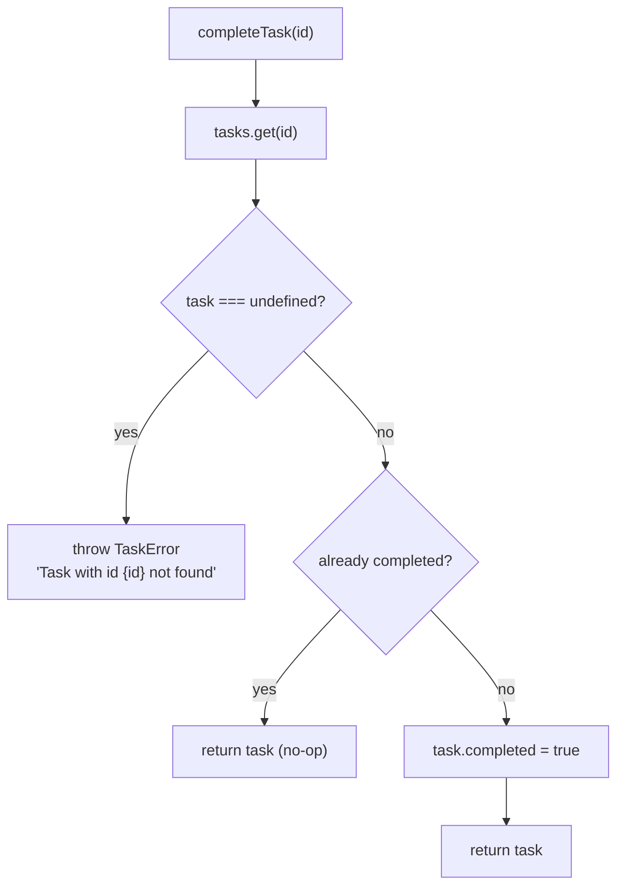
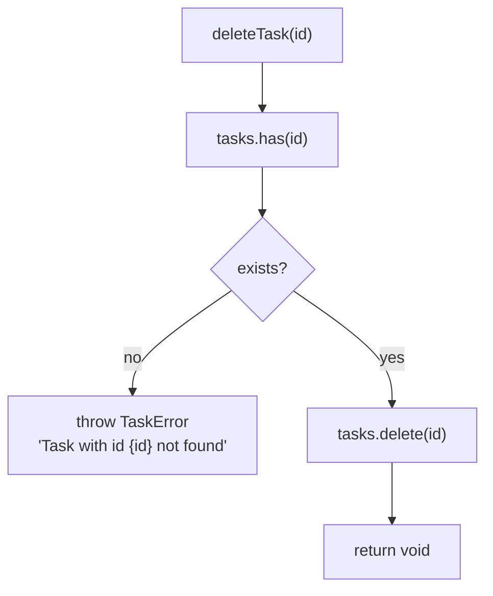
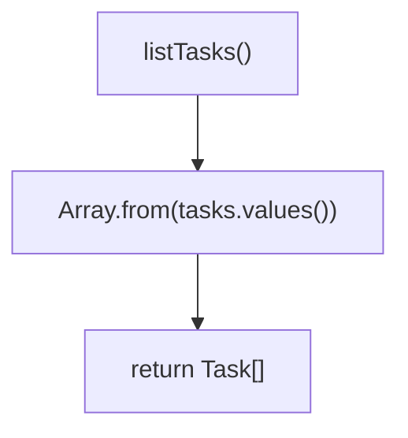
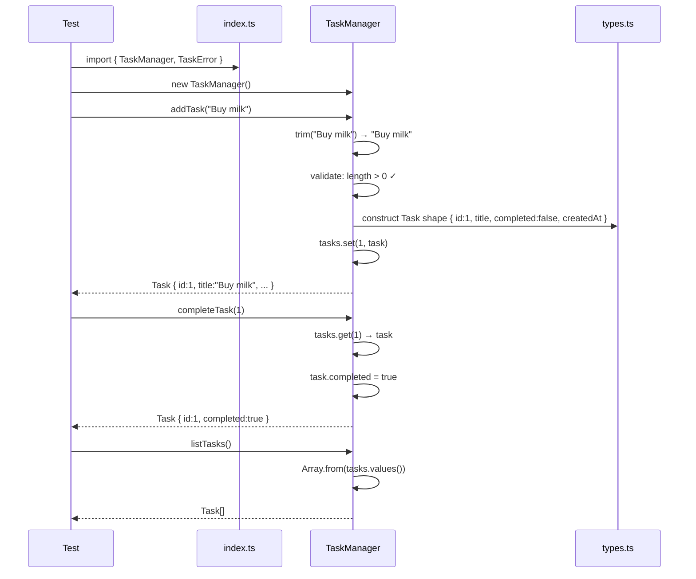
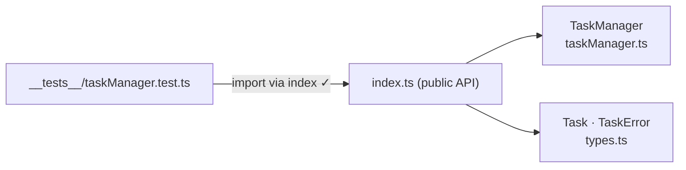
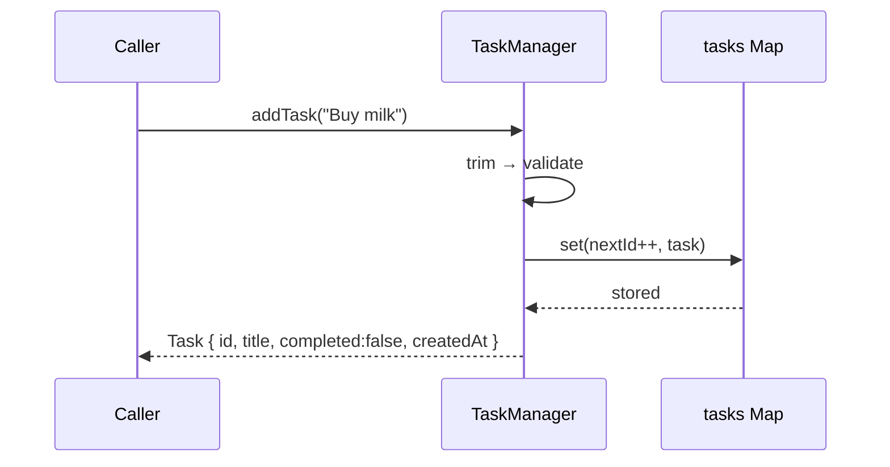
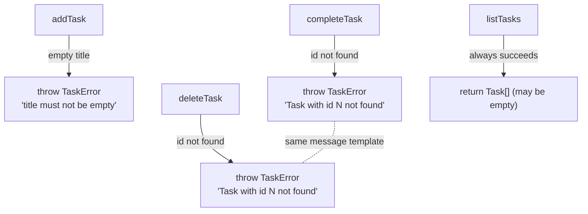
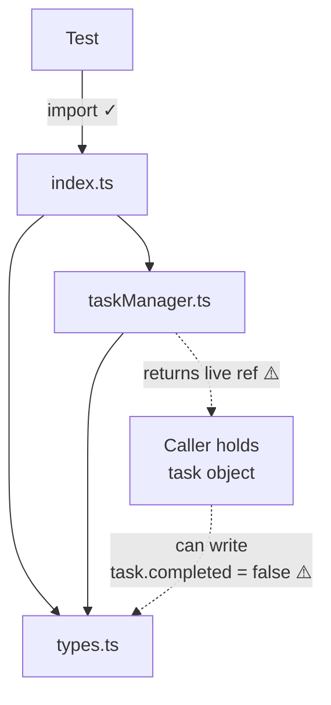

# Internals

> Generated by `/ts-code-viewer` on 2026-05-31.
> All diagrams are structural (static analysis), not behavioral.
> View in VS Code with `Cmd+Shift+V`, or paste blocks into [mermaid.live](https://mermaid.live).

---

## Class Diagram

Shows all exported classes and interfaces, their fields, methods, and relationships.

- `TaskManager` is the center of gravity — it owns all state and exposes the entire public API.
- `Task` is a pure data shape with no behavior; all mutations go through `TaskManager`.
- `TaskError` is a thin error subclass; currently no error codes or subtypes — a single class handles all failure cases.
- `completed` is not `readonly` on the `Task` interface (review finding: any caller can mutate it directly).

---

## Call-Flow: addTask

```mermaid
flowchart TD
  addTask["addTask(title)"]
  addTask --> trim["trim(title)"]
  trim --> validate{trimmed.length === 0?}
  validate -->|yes| throwEmpty["throw TaskError\n'title must not be empty'"]
  validate -->|no| construct["construct Task\n{id: nextId++, title, completed: false, createdAt: new Date()}"]
  construct --> store["tasks.set(task.id, task)"]
  store --> returnTask["return task"]
```

- Validation is a single inline check — no dedicated validator function or class.
- `nextId++` increments as a side effect inside the task construction expression.
- `new Date()` is called inline — not injectable, making `createdAt` non-deterministic in tests.
- The returned `task` is the same object stored in the `Map` — callers hold a live reference.

---

## Call-Flow: completeTask

- The no-op branch (`already completed → return`) is implicit: assigning `true` to `true` is silently harmless. No explicit early-return guard exists in code — the diagram shows the intended semantic, not an explicit branch.
- Mutation happens on the live object in the `Map` — the same reference the caller holds from `addTask`.

---

## Call-Flow: deleteTask

- Two Map lookups: `has(id)` + `delete(id)`. `Map.delete` returns `false` if key not found — the `has` check is redundant (review finding).
- Clean termination — no return value, callers get `undefined`.

---

## Call-Flow: listTasks

- Materializes a new array on every call — insertion order preserved via `Map`.
- The array is a shallow copy of references; the `Task` objects inside are still the live Map objects.

---

## Sequence: Main Path (addTask end-to-end)

- `index.ts` is transparent at runtime — it's a re-export barrel with no logic. The test talks directly to `TaskManager` after importing through it.
- `Types` (types.ts) has no runtime behavior — it only defines shapes. The "construct Task shape" step is pure object literal construction inside `TaskManager`.

---

## Review Slices

### 1. Entry-Point Slice

**Review question:** How does a consumer reach `TaskManager` from the public API?

**Why it matters:** Confirms `index.ts` is the single entry point and no internal files are directly accessible.

- Single import path from tests to implementation — boundary is enforced.
- `index.ts` is a transparent barrel (no logic), so the actual runtime entry is `TaskManager`.
- Any future consumer (CLI, HTTP handler) would import the same way.

---

### 2. Success-Path Slice

**Review question:** What is the exact sequence for a successful `addTask` call?

**Why it matters:** Shows all collaborators and the order of operations for the happy path.

- Three steps only: validate → construct → store → return.
- No async, no I/O, no external dependencies — fully synchronous and testable.
- The returned object is the same reference stored in `Map` (see finding in class diagram).

---

### 3. Failure-Path Slice

**Review question:** How do all four public methods handle invalid input or missing IDs?

**Why it matters:** Shows error coverage across the entire public API surface.

- `addTask` is the only method that validates input shape; the other three validate existence.
- `completeTask` and `deleteTask` share identical error message templates — a DRY opportunity (`TaskError.notFound(id)` static factory).
- `listTasks` has no failure path — always returns an array (empty if no tasks).

---

### 4. Boundary-Risk Slice

**Review question:** Are there any cross-layer violations or encapsulation risks?

**Why it matters:** Surfaces the one remaining design concern after the import boundary fix.

- Import boundary: **clean** — tests go through `index.ts` only.
- Encapsulation boundary: **risk** — `TaskManager` returns the same object reference it stores in the `Map`. A caller can mutate `task.completed` directly without going through `completeTask`.
- Fix: make `Task.completed` `readonly` and return a spread copy from `completeTask`.
